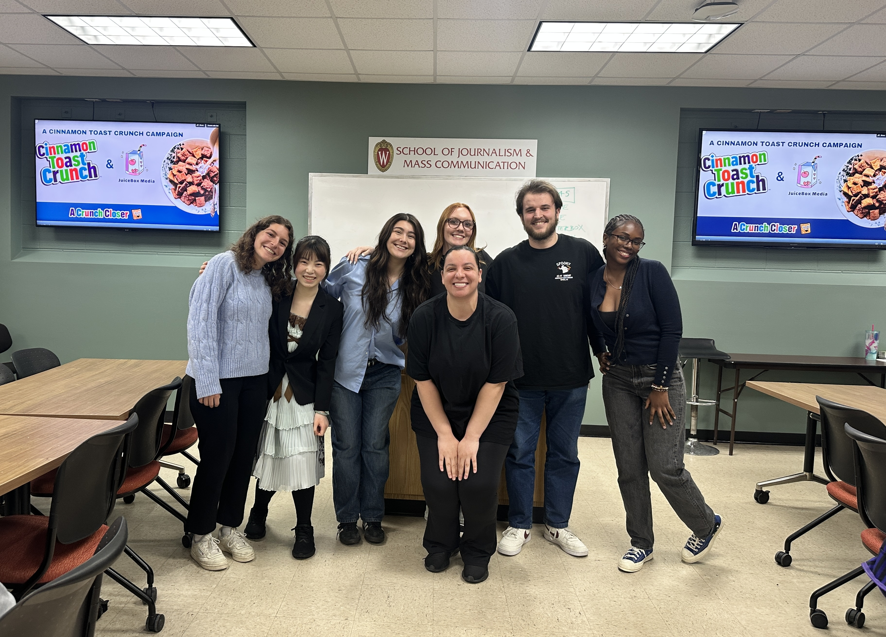

## Introduction
This campaign was developed as part of JOURN 345 and follows a strategic planning process. Our work begins with a situation analysis, where we examined the client’s background, industry landscape, target audiences, and key challenges to establish a  understanding of the problem space.

Building on these insights, we developed a campaign strategy that defines the campaign objectives, core messages, and positioning. From this strategic foundation, we created integrated execution plans across multiple channels, including a PR plan, media plan, and social media plan.

To support implementation, we assembled a media kit to ensure clear and professional communication with external stakeholders. Finally, the creative plan outlines the visual and messaging approach that brings the strategy to life and ensures cohesion across all campaign elements.

## Make impacts 

As the Design Director, I led the majority of the design work, with a primary focus on the final campaign book, which is presented below. In addition, I took on a substantial portion of the media plan responsibilities, including data collection, organization, and refinement.




## Our final slides

<embed src="slides/cinn_deck.pdf" type="application/pdf" width="100%" height="600px"/>

## Checkout our Campaign book

::: {.columns .campaign-split}
::: {.column width="40%"}
### Key Takeaways

#### Situation
- We conducted a comprehensive brand overview, historical tracking, and industry overview. By applying the **4P Framework** (Product, Place, Price, Promotion), we identified strategic opportunities to revitalize the brand. 

#### Validation
- To validate our strategy, we deployed a **Qualtrics survey** and leveraged social media platforms like Facebook to engage with our core demographics. This ensured our campaign goals remained strictly aligned with consumer needs and CTC’s brand mission.
:::

::: {.column width="5%"}
:::

::: {.column width="55%"}
```{=html}
<div style="border: 1px solid #ddd; border-radius: 8px; overflow: hidden;">
  <iframe src="pdf/campaign book1.pdf" width="100%" height="600px" style="border: none;"></iframe>
</div>


