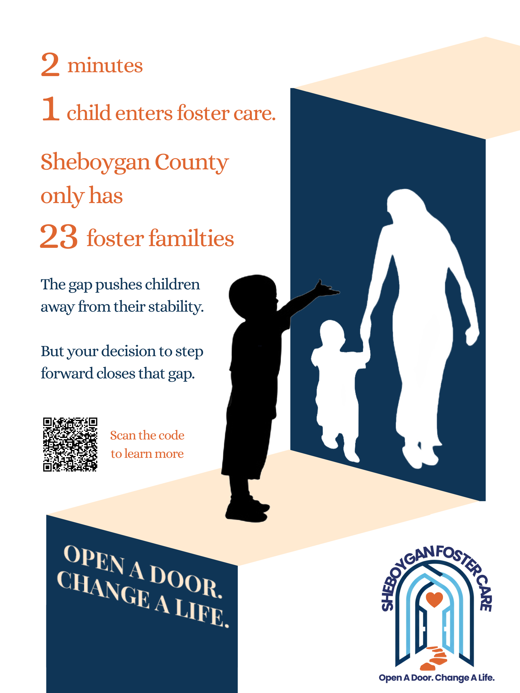
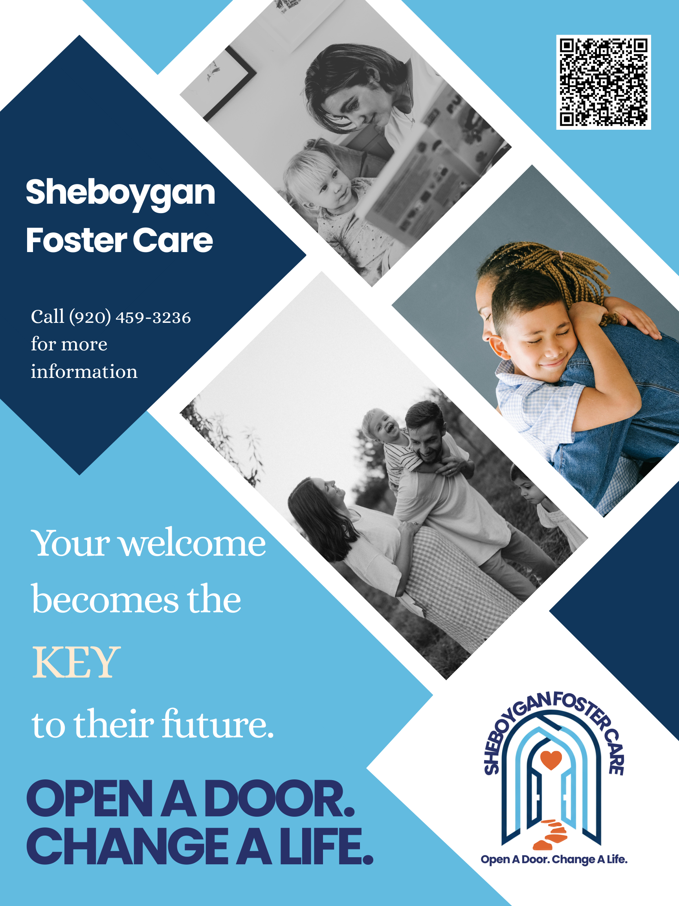
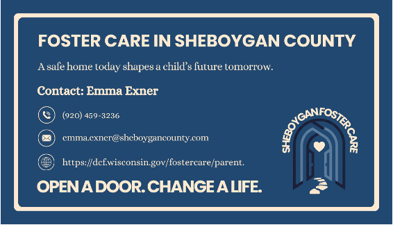
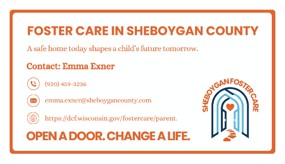

## Introduction

The work has been featured by SJMC website. 
- Check out the report: https://sjmc.wisc.edu/news/in-sheboygan-students-learn-the-power-of-storytelling/

## See my creative productions

### Posters
::: {.columns}
::: {.column width="50%"}

:::

::: {.column width="50%"}

:::
:::

---

### Business cards

#### Dark Series
::: {.columns}
::: {.column width="50%"}

:::

::: {.column width="50%"}

:::
:::

#### Light Series
::: {.columns}
::: {.column width="50%"}

:::

::: {.column width="50%"}

:::
:::

### Our final slides
<embed src="slides/sheboygan_deck.pdf" type="application/pdf" width="100%" height="600px"/>

